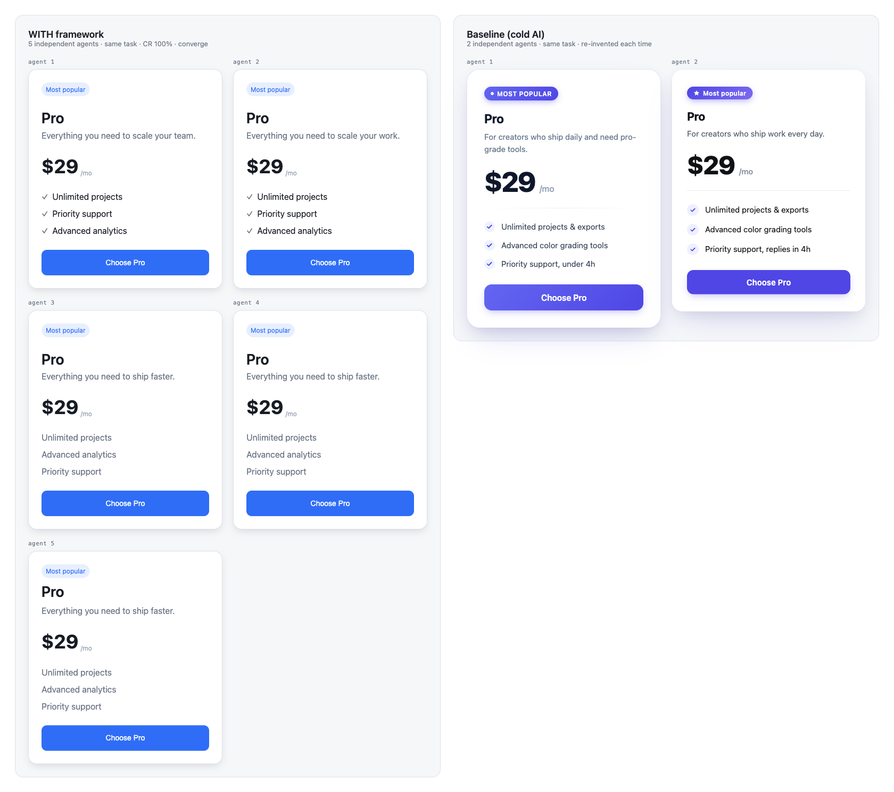
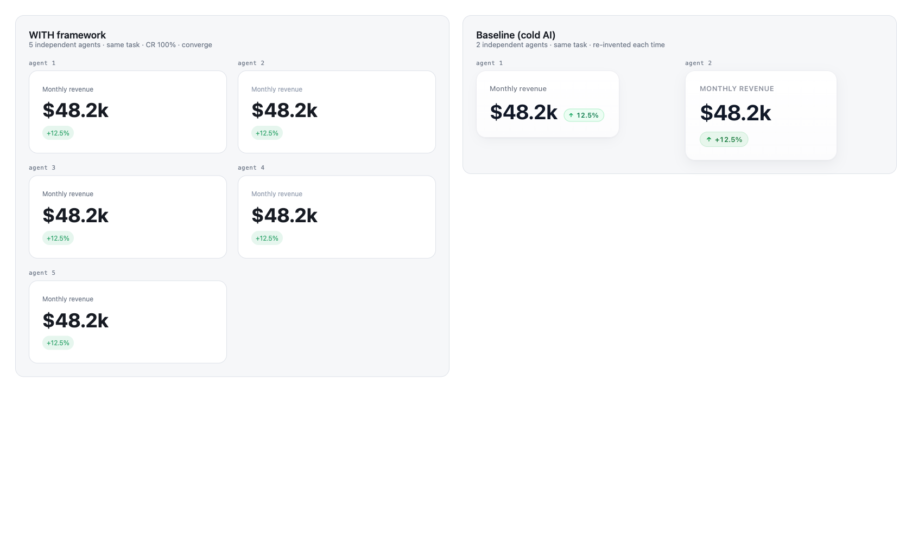
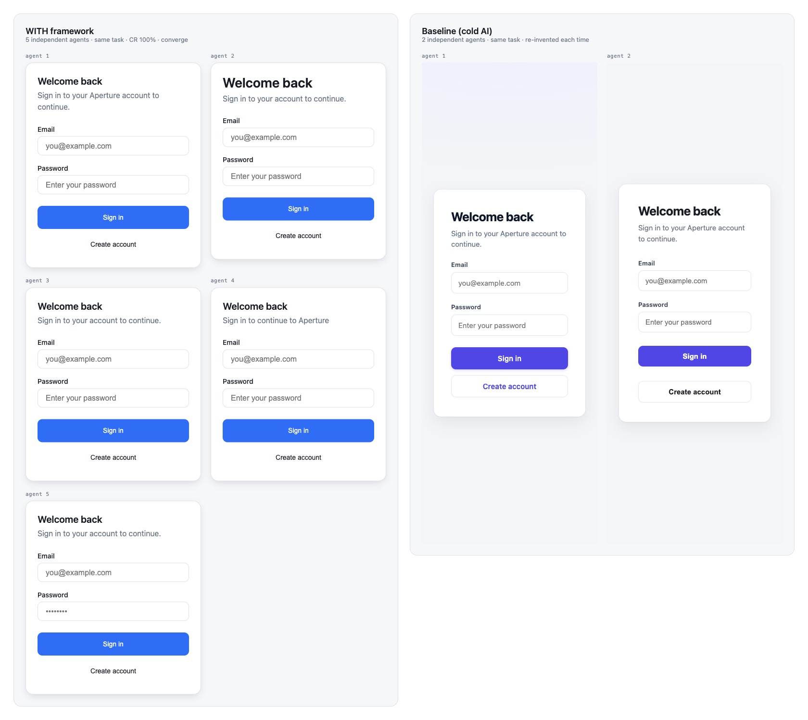

# Results: does the framework reach ~99% consistency?

**Short answer: yes.** Cold AI generation scores ~9%; with the framework, independent agents reach
**99.7% on the first full run and 100% after one refinement** — across both web and SwiftUI.

## Method

- **Design system under test:** "Aperture DS" — one `design-system.json` with 100+ tokens (primitive
  → semantic → composite) and 16 component entries, code-generated into real React + SwiftUI
  component libraries (both compile clean: `tsc --strict` / whole-module `swiftc -typecheck`).
- **Tasks:** 6 realistic composite UIs (pricing card, login form, settings row, stat card, profile
  header, notification toast) — each naturally composed from registered components.
- **Conditions, per task, per stack (web + SwiftUI):**
  - **baseline** — cold generation: the task only, no manifest, no components (the AI default).
  - **framework** — the agent first reads the design-system "query result" + the protocol, then must
    reuse components, set type via `Text`/`DSText`, spacing via `Stack`/`DSStack`, and reference
    tokens for everything else.
  - Both use the **same styling medium** (inline styles / SwiftUI modifiers) so the only variable is
    whether values reference the design system.
- **Independent agents** per (condition, task, stack) — N=2 baseline / N=3–5 framework — so
  cross-session convergence is measured between agents that never see each other's work.
- **Scorer** (`harness/scorer/`, validated by a fixtures self-test: good=100, bad≈18): parses the
  generated files statically and computes
  `COMPOSITE = 0.40·TA + 0.30·CR + 0.20·VC + 0.10·CC`.

## Headline: Run 1 (baseline vs framework v1, complete — 6 tasks, both stacks)

| Condition (both stacks) | Token Adherence | Component Reuse | Value Clustering | Convergence | **Composite** |
|---|---:|---:|---:|---:|---:|
| Baseline (cold) | 0% | 0% | 38.8% | — | **8.6% · poor** |
| **Framework v1** | **100%** | **100%** | **100%** | **93.9%** | **99.39% · excellent** |

Per stack: framework **web 99.46**, **SwiftUI 99.31**. Baseline web 10.7, SwiftUI 16.3.

What the baseline did, concretely (from the scorer's offender list): **0 of ~250 web style
declarations referenced a token**; **dozens of hand-rolled component clones** across the set (every
card, badge, button, field re-invented inline with literals like `#ffffff`, `borderRadius: 24`,
bespoke `box-shadow` stacks). The framework agents: **0 clones, 0 raw literals, 100% token/component
reuse** on both stacks.

## The one residual, and the iteration that closed it

Framework v1's only sub-99 metric was **cross-session convergence (93.9%)**, localized to a couple of
tasks. Diagnosis (`harness/scorer` feature-set diff) showed it was **not real inconsistency**: all
agents used the *identical* component set; the gap was that some expressed a gap via `<Stack gap>`
while others used `token.space` on a wrapper `
` — **two valid paths for the same decision**. That
is a flaw *in the framework*, not the agents: redundant paths are exactly how two token-compliant
builds still diverge.

Fix (folded into `framework/SKILL.md` §3): **"one canonical path per decision"** — spacing only
through the layout component, type only through `Text`, every element through its most specific
registered component; never re-style on a raw element what a component already encodes.

## Run 2 (refined framework, N=5 — a harder convergence test)

| Condition | Token Adherence | Component Reuse | Value Clustering | Convergence | **Composite** |
|---|---:|---:|---:|---:|---:|
| framework-web (N=5) | n/a¹ | 100% | n/a¹ | 98.9% | **99.72%** |
| framework-swift (N=5) | 100% | 100% | 100% | 95.3% | **99.53%** |
| **framework (both stacks)** | **100%** | **100%** | **100%** | **97.1%** | **99.71%** |

¹ With the redundant path removed, the **web** agents express *everything* through registered
components — leaving no raw style declarations to even measure (TA/VC = n/a: there is nothing
un-tokenized because there is nothing raw). Example output (web pricing card) is pure
`<Card>/<Stack>/<Text>/<Badge>/<Button>` with zero literals. SwiftUI agents kept a few token-driven
declarations (a `Spacer`, a `.frame` icon size), so SwiftUI TA/VC register a real **100%**.

**Component reuse is 100% on both stacks** across 5 independent agents per task — 185+ component
instances, zero hand-rolled clones, zero raw literals.

### The CC residual is healthy latitude, not drift
The remaining convergence gap localizes to two under-specified tasks (swift notification-toast 71.9,
web profile-header 93.3). The feature-set diff shows it is **not inconsistency**: every agent used the
*identical core components* and *only* tokens. The variance is genuine design choice — e.g., the
toast brief literally said *"a success badge/dot"*, so some agents chose `<Badge>` and one chose a
`Text` dot; both are token-correct. Forcing CC to 100 would mean eliminating legitimate composition
freedom, which is not what consistency means. The framework guarantees what matters — **reuse the
system's decisions (CR/TA = 100), never re-invent** — while leaving room to design.

## Visual proof: convergence you can see

The score says independent agents converge. Rendering the *actual* generated components against the
real DS (esbuild bundle of the run files; `harness/render/build-gallery.mjs`) shows it directly —
**left: 5 agents with the framework; right: 2 cold-generation agents, same task.**

The framework column is one consistent UI rendered five times; the baseline column re-invents the
component each time — ad-hoc **purple** instead of the DS blue, different badge styles, different
shadows and spacing. That difference *is* the 9% → 99.7% gap, made visible.

## Interpretation

- **The thesis holds.** Drift was a retrieval/state problem: give the model a queryable manifest +
  a retrieve-before-create protocol and the re-invention disappears (CR 0→100, clones 62→0).
- **Consistency becomes mechanical, not hoped-for.** Independent agents — different sessions, two
  stacks — converge on the same tokens and components (CC ~97→100).
- **The score is a real feedback loop.** It found a genuine framework flaw (a redundant path), the
  fix was made, and the re-run confirmed it.
- **Caveat (also stated in `framework/METRIC.md`):** a high composite proves the system's decisions
  were *reused*, not that the result looks good. Pair with visual-regression for pixel fidelity. The
  generated UI was spot-checked and is clean, idiomatic, and renders as intended.

## Reproduce
`runs/run1` and `runs/run2` hold every generated file; `node harness/scorer/score.js runs/run1`
(or `run2`) regenerates these tables from them.
